<picture>
  <source media="(prefers-color-scheme: dark)" srcset="assets/header-dark.svg">
  <source media="(prefers-color-scheme: light)" srcset="assets/header-light.svg">
  
</picture>

## Now shipping

Live products, built and run end to end — product, code, infra, payments.

| | Product | What it does | Built on |
|---|---|---|---|
| 📄 | **[SuitedCV](https://suitedcv.com)** | One master CV, AI-tailored for every job. Keep/skip review on each change, ATS-safe PDF export, full Hebrew + RTL. Built with [@tomerhayundev](https://github.com/tomerhayundev). | Workers · D1 · R2 · Claude |
| 🧱 | **[Pashut Code](https://pashutcode.com)** | Hebrew-first AI website builder — describe the site in Hebrew, get it built and hosted. | Workers · KV · MCP |
| 🛒 | **[Dalpak](https://dalpak.app)** | Embeddable AI shopping agent for e-commerce stores: answers product questions, recommends items, builds carts, captures leads. Hebrew, English & Arabic. | Workers · OpenRouter |
| ⚔️ | **[PoE Tools](https://poetools.dev)** | Path of Exile toolkit — cluster jewel calculator, div-card flips, budget and currency tools on live market prices. Every tool is also exposed over MCP. | React · Workers · MCP |

## Building in the open

| Project | What it is |
|---|---|
| **botkit-ai** | Python framework for AI Telegram bots — OpenRouter/OpenAI, `@tool()` decorator, alerts, built-in paywall, tools exposed as an MCP server. |
| **Sheql** (שקל) | Israeli bank transactions → local DB → MCP. Ask Claude "what's my financial state?" and get a real answer. |
| **[question-retriever-leetcode](https://github.com/YanivGabay/question-retriever-leetcode)** | Picks LeetCode questions for the *Help Me LeetCode* WhatsApp community. [Live →](https://leetcode-question-retriever.web.app) |
| **[mcp-naming-bias](https://github.com/YanivGabay/mcp-naming-bias)** | Research: how tool names and ordering bias an LLM's MCP tool selection. |

Also: [easy-edge-tts](https://github.com/YanivGabay/easy-edge-tts) · [tiktok-uploader](https://github.com/YanivGabay/tiktok-uploader) · [whatsapp-mcp](https://github.com/YanivGabay/whatsapp-mcp) · [secrets-vault](https://github.com/YanivGabay/secrets-vault) · [Zapedit](https://yanivgabay.github.io/zapedit-site/)

## Teaching

I teach **C** and **Operating Systems** at Hadassah Academic College. Every lecture, example and exercise is open source:

**[📂 cs-lectures-by-yaniv-gabay](https://github.com/YanivGabay/cs-lectures-by-yaniv-gabay)** —
[Operating Systems (C)](https://github.com/YanivGabay/cs-lectures-by-yaniv-gabay/tree/main/OperatingSystems-C-SecondYear) ·
[Intro to CS](https://github.com/YanivGabay/cs-lectures-by-yaniv-gabay/tree/main/Intro2Cs) ·
[Modular Programming](https://github.com/YanivGabay/cs-lectures-by-yaniv-gabay/tree/main/ModularProgramming) ·
[Advanced C++](https://github.com/YanivGabay/cs-lectures-by-yaniv-gabay/tree/main/AdvancedCPP)

Found a typo or a bug in an example? Issues and PRs are welcome.

## Stack

| Area | Tools |
|---|---|
| **Edge** |      |
| **AI** |      |
| **Languages** |       |
| **Apps & games** |     |
| **Payments** |   |
| **Ops** |     |

## Writing

- [Optimizing Matrix Operations in C: Arrays of Linked Lists](https://medium.com/@yaniv242/optimizing-matrix-operations-in-c-arrays-of-linked-lists-a2f5aebd394f)

---

**בעברית:** אני יניב גבאי — מהנדס תוכנה בטאבולה ומרצה במכללה האקדמית הדסה ל־C ולמערכות הפעלה. בונה מוצרים בעברית כמו [פשוט קוד](https://pashutcode.com), [SuitedCV](https://suitedcv.com) ו[דלפק](https://dalpak.app). כל חומרי הקורסים [פתוחים כאן](https://github.com/YanivGabay/cs-lectures-by-yaniv-gabay) — מוזמנים לפתוח issues ולתרום.

